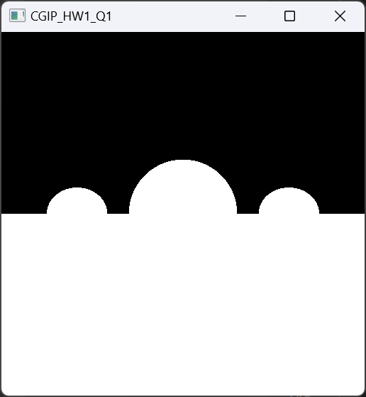
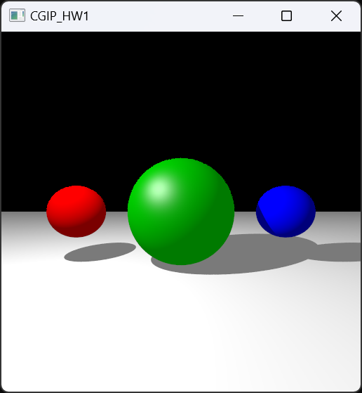

# 컴퓨터그래픽스및영상처리 과제 1

- 본 과제의 개발 환경으로는 vscode와 cmake를 사용하였습니다.
- 초기 환경 설정 및 openGL을 다루는 데에 필요한 스킬은 링크를 따라가면 확인하실 수 있는 [유튜브 영상 재생목록](https://www.youtube.com/playlist?list=PLvNHCGtd4kh_cYLKMP_E-jwF3YKpDP4hf)을 참고하여 공부하였습니다.
- 이 외에도 [LearnOpenGL.com](https://learnopengl.com) 및 [Ray Tracing in One Weekend](https://raytracing.github.io/books/RayTracingInOneWeekend.html) 등을 참고하였고, 김소영 학우의 도움을 받아 진행하였습니다.

---

### 문서 목차
- [환경 설정](#환경-설정)

- [실행 방법](#실행-방법)

- [결과 화면](#결과-화면)

- [Code 설명](#code-설명)

---

### 환경 설정

- vscode version 1.87을 사용하였습니다.
- cmake는 최소한 version 3.23을 사용해야 합니다.
- 본 repository에 있는 CMakeLists.txt와 Dependency.cmake 파일을 통해 필요한 library를 초기 빌드 시 한 번에 다운로드 받을 수 있습니다.

---

### 실행 방법

1. vscode를 실행 후, 해당 project가 있는 directory를 열어 project folder를 load해줍니다.
2. CMake를 위한 vscode extension이 필요하므로, extension이 존재하지 않는다면 vscode 좌측의 Extensions 탭에서 cmake를 검색하여 CMake와 CMake Tools를 install 해줍니다.
3. Windows 환경에서는 ctrl + shift + p, Mac 환경에서는 cmd + p 키를 입력하여 command를 입력할 수 있는 창에서 cmake를 검색 후 CMake:Configure를 선택하고, 운영체제에 맞게 컴파일러 키트를 선택합니다.

    (혹은 해당 프로젝트가 있는 폴더에서 cmd 창을 열고 code .를 입력하면 자동으로 CMake project임을 인식하고 configure를 위한 팝업이 뜹니다.)

    Configure를 수행하면 vscode 하단의 OUTPUT 탭에 "Configuring project: CGIP_hw1"이라고 출력되는 것을 확인하실 수 있습니다.

4. CMake 프로젝트로 인식이 되었으면, 다시 command를 입력할 수 있는 창을 열고 CMake를 검색하여 CMake:Build를 선택합니다 (혹은 단축키인 F7을 입력합니다).

    초기 build라면, 이때 필요한 library가 전부 build 폴더에 다운로드 됩니다.

5. 초기 build를 마친 후, ctrl + F5를 입력하면 Debug 모드로 project가 실행됩니다.
Debug 모드이므로 하단의 DEBUG CONSOLE에서 출력 및 동작을 확인할 수 있습니다.

---

### 결과 화면

- Q1에 대한 결과 화면은 다음과 같습니다.
    - 세 개의 구와 하나의 평면에 대하여 색 표현 없이 ray tracing 결과만 흰색으로 나타낸 화면입니다.
<p align="center">
    
</p>
    

- Q2에 대한 결과 화면은 다음과 같습니다.
    - 세 개의 구와 하나의 평면의 색상을 지정하고, Phong shading을 통해 빛이 들어옴에 따른 shading 효과를 설정하고, 그림자를 생성하였습니다. 또한 gamma correction을 수행하였습니다.
<p align="center">
    
</p>

- Q3에 대한 결과 화면은 다음과 같습니다.
    - Q2의 결과에서 각 pixel의 sampling을 0부터 1까지의 float 값을 랜덤으로 생성하여, 각 픽셀에 대하여 64번 sampling을 수행하여 anti-aliasing을 적용하였습니다.
    - 그림자 부분을 비교하면 anti-aliasing이 적용된 것이 확연하게 드러납니다.
<p align="center">
    
</p>

---

### Code 설명

- 모든 소스코드 파일은 src 폴더에 있습니다.
    - Ray.h 파일은 Ray를 나타냅니다. 해당 헤더는 Camera.h에서 호출되어 ray tracing에 기여합니다.
    - Camera.h 파일은 카메라, 즉 시점을 지정합니다.
    
        이 헤더 파일에서 getRay와 getRandomRay 함수를 선언하였고, 이를 통해 ray tracing이 가능해집니다.
    - Light.h 파일은 광원을 나타냅니다.
    - Plane.h 파일은 평면을 나타냅니다.
    - Sphere.h 파일은 구를 나타냅니다.
    - Scene.h 파일은 전체 scene, 즉 생성한 구와 평면의 그룹을 나타냅니다.

    - main.cpp 파일이 동작의 핵심이 되는 파일입니다.

        아래는 main.cpp 파일의 각 함수에 대하여 설명하기 위한 내용입니다.

- array<int, 4> hitSurface(Ray ray, Scene scene) 함수
    
    이 함수는 ray가 object의 surface를 지나가는지 확인하기 위한 함수입니다.
    내부의 코드는 다음과 같습니다.

    먼저 최종 반환값을 리턴하기 위한 변수를 선언하고 초기값을 지정합니다.
    ```
    array<int, 4> hit = {0, 0, 0, 0};
    ```
    구에 대하여 계산하는 경우, 구의 방정식을 적용하여 도출한 t에 대한 식이 at^2 + bt + c = 0이라고 하였을 때, 근의 공식을 통해 실제로 hit하는지 아닌지를 확인합니다.

    만일 근의 공식에서 sqrt 내부에 들어가야 하는 판별식이 0보다 작다면 hit하지 않는 것이므로, 이에 맞게 값을 지정합니다.
    ```
    for(int i = 0; i < 3; i++) {
        Sphere sphere = scene.sphere[i];
        float a = dot(ray.direction, ray.direction);
        float b = 2 * dot(ray.direction, ray.origin - sphere.center);
        float c = dot(ray.origin - sphere.center, ray.origin - sphere.center) - (sphere.radius * sphere.radius);

        float discriminant1 = b * b - 4 * a * c;

        if(discriminant1 >= 0) {
            hit[i] = 1;
        } else {
            hit[i] = 0;
        }
    }
    ```
    평면의 경우 normal vector와 ray direction이 평행하지 않으면 hit할 것이므로, 이에 맞게 값을 지정합니다.
    ```
    Plane plane = scene.plane;

    float discriminant2 = glm::dot(ray.direction, plane.normal);

    if(discriminant2 != 0) {
        hit[3] = 1;
    } else {
        hit[3] = 0;
    }
    ```
    최종적으로 hit을 했는지 안 했는지에 대한 array를 반환합니다.
    ```
    return hit;
    ```

- array<float, 4> calculateT(Ray ray, Scene scene) 함수
    
    이 함수는 ray의 origin부터 direction을 따라가 object에 부딪히는 지점 중 가장 가까운 지점인 t0의 값을 구하기 위한 함수입니다.
    내부의 코드는 다음과 같습니다.

    먼저 최종 반환값을 리턴하기 위한 변수를 선언하고 초기값을 지정합니다.
    ```
    array<float, 4> t = {-1.0f, -1.0f, -1.0f, -1.0f};
    ```
    위와 마찬가지로 구에 대하여 계산하는 경우, 구의 방정식을 적용하여 도출한 t에 대한 식이 at^2 + bt + c = 0이라고 하였을 때, 근의 공식을 통해 실제로 hit할 때의 t 값을 구합니다.
    ```
    for(int i = 0; i < 3; i++) {
        Sphere sphere = scene.sphere[i];
        float a = dot(ray.direction, ray.direction);
        float b = 2 * dot(ray.direction, ray.origin - sphere.center);
        float c = dot(ray.origin - sphere.center, ray.origin - sphere.center) - (sphere.radius * sphere.radius);

        float discriminant = b * b - 4 * a * c;

        t[i] = ((-1) * b - sqrt(discriminant)) / (2 * a);
    }
    ```
    평면에 대하여 계산하는 경우는 다음과 같습니다.
    ```
    Plane plane = scene.plane;
    t[3] = dot(plane.normal, plane.point - ray.origin) / dot(plane.normal, ray.direction);
    ```
    최종적으로 각 object의 t0 값을 저장한 array t를 반환합니다.
    ```
    return t;
    ```

- vec3 evaluateRay(Ray ray, float t) 함수

    이 함수는 t 값을 계산한 이후 실제 ray가 도달하는 3D 공간 상의 지점을 계산하기 위한 함수입니다.
    내부의 코드는 다음과 같습니다.
    ```
    return ray.origin + t * ray.direction;
    ```

- HitSurface intersect(Ray ray, Scene scene, float tMin, float tMax) 함수

    이 함수는 HitSurface 구조체를 반환합니다. 

    HitSurface 구조체는 다음과 같이 선언되어 있습니다.
    ```
    struct HitSurface {
        bool hit;
        float t;
        Color color;
        int firstSurface;
    };
    ```
    이 함수는 내부에서 tMin과 tMax 사이의 tBest 값을 찾고, tMax를 tBest 값으로 변환하여 비교해가며 최적의 tBest를 찾습니다.

    먼저 최종 반환값을 리턴하기 위한 변수를 선언하고 초기값을 지정합니다.
    ```
    HitSurface hsf = {false, -1.0f};
    ```
    초기의 tBest는 tMax이며, 하나라도 hit한 경우 t 값을 계산하여 tValues라는 array에 집어넣습니다.
    만일 tValues array 안에 있는 t 값이 tMin보다 크고 현재의 tBest보다 작다면 t가 tBest가 됩니다.
    그리고 tBest를 가지는 hsf를 firstSurface로 지정합니다.
    ```
    float tBest = tMax;

    if (hitSurface(ray, scene)[0] != 0 || hitSurface(ray, scene)[1] != 0 || hitSurface(ray, scene)[2] != 0 || hitSurface(ray, scene)[3] != 0) {
        array<float, 4> tValues = calculateT(ray, scene);
        for (int i = 0; i < 4; i++) {
            float t = tValues[i];
            if (t > tMin && t < tBest) {
                tBest = t;
                hsf.hit = true;
                hsf.t = tBest;

                hsf.firstSurface = i;
            }
        }
    }
    ```
    최종적으로 hsf를 반환합니다.
    ```
    return hsf;
    ```

- vec3 calculateShading(Ray ray, Scene scene, HitSurface hsf, Light light) 함수

    이 함수는 shading과 shadow를 계산하여 각 object의 각 pixel에 색을 적용하기 위한 함수입니다.

    먼저 최종 반환값을 리턴하기 위한 변수와 값들을 저장하기 위한 변수, 그리고 계산에 필요한 변수들을 선언하고, 값을 지정합니다.
    ```
    vec3 shading = vec3(1, 1, 1);

    array<float, 4> I;
    array<glm::vec3, 4> kd, ks, ka, n, l, h, v, point;
    array<Color, 4> Ia;
    array<int, 4> specular;

    int i = hsf.firstSurface;
    if (i == 3) {
        kd[i] = scene.plane.kd;
        ks[i] = scene.plane.ks;
        ka[i] = scene.plane.ka;
        I[i] = light.intensity;
        point[i] = evaluateRay(ray, hsf.t);
        v[i] = normalize(-ray.direction);
        n[i] = scene.plane.normal;
        l[i] = normalize(light.position - point[i]);
        h[i] = normalize(v[i] + l[i]);
        Ia[i].r = light.color.r;
        Ia[i].g = light.color.g;
        Ia[i].b = light.color.b;
        specular[i] = scene.plane.specular;
    } else {
        kd[i] = scene.sphere[i].kd;
        ks[i] = scene.sphere[i].ks;
        ka[i] = scene.sphere[i].ka;
        I[i] = light.intensity;
        point[i] = evaluateRay(ray, hsf.t);
        v[i] = normalize(-ray.direction);
        n[i] = normalize(point[i] - scene.sphere[i].center);
        l[i] = normalize(light.position - point[i]);
        h[i] = normalize(v[i] + l[i]);
        Ia[i].r = light.color.r;
        Ia[i].g = light.color.g;
        Ia[i].b = light.color.b;
        specular[i] = scene.sphere[i].specular;
    }
    ```
    Shadow를 생성하기 위한 변수도 선언합니다.
    ```
    Ray shadowRay = {point[i], l[i]};
    HitSurface hsfShadow = intersect(shadowRay, scene, 0.0f, INFINITY);
    ```
    shadowRay를 만난다면 ambient shading만이 적용되고, 이외의 경우에는 전부 Phong shading이 적용횝니다.
    ```
    if(hsfShadow.hit) {
        shading.r = ka[i].r * Ia[i].r;
        shading.g = ka[i].g * Ia[i].g;
        shading.b = ka[i].b * Ia[i].b;
    } else {
        shading.r = ka[i].r * Ia[i].r + kd[i].r * I[i] * std::max(0.0f, dot(n[i], l[i])) + ks[i].r * I[i] * pow(std::max(0.0f, dot(n[i], h[i])), specular[i]);
        shading.g = ka[i].g * Ia[i].g + kd[i].g * I[i] * std::max(0.0f, dot(n[i], l[i])) + ks[i].g * I[i] * pow(std::max(0.0f, dot(n[i], h[i])), specular[i]);
        shading.b = ka[i].b * Ia[i].b + kd[i].b * I[i] * std::max(0.0f, dot(n[i], l[i])) + ks[i].b * I[i] * pow(std::max(0.0f, dot(n[i], h[i])), specular[i]);
    }
    ```
    최종적으로 위에서 선언한 shading을 반환합니다.
    ```
    return shading;
    ```

- float gammaCorrect(float value, float gamma) 함수

    이 함수는 gamma correction을 위한 함수로, gamma correction을 하기 위한 식을 포함합니다.
    ```
    float gammaCorrect(float value, float gamma) {
        return pow(value, 1.0f / gamma);
    }
    ```

- int main() 함수
    이 함수는 창을 띄우기 위한 부분과 pixel을 채워 이미지를 생성하기 위한 부분으로 구성되어 있습니다.

    중요한 부분은 pixel을 채워 이미지를 생성하는 부분이므로, 해당 코드만을 아래에서 다루겠습니다.

    카메라와 object(3 개의 구와 하나의 평면)를 선언하고, 생성한 각 object를 scene에 집어 넣습니다.

    광원에 대한 내용도 추가하고, gamma correction을 위한 gamma 값 또한 선언합니다.
    ```
    Camera camera;

    Sphere S1 = {vec3(-4, 0, -7), 1, {1, 0, 0}, vec3(0.2, 0, 0), vec3(1, 0, 0), vec3(0, 0, 0), 0};
    Sphere S2 = {vec3(0, 0, -7), 2, {0, 1, 0}, vec3(0, 0.2, 0), vec3(0, 0.5, 0), vec3(0.5, 0.5, 0.5), 32};
    Sphere S3 = {vec3(4, 0, -7), 1, {0, 0, 1}, vec3(0, 0, 0.2), vec3(0, 0, 1), vec3(0, 0, 0), 0};

    Plane P = {vec3(0, 1, 0), vec3(0, -2, 0), {1, 1, 1}, vec3(0.2, 0.2, 0.2), vec3(1, 1, 1), vec3(0, 0, 0), 0};

    Scene scene = {S1, S2, S3, P};

    Light light = {vec3(-4, 4, -3), {1, 1, 1}, 1.0f};

    float gamma = 2.2f;
    ```
    각 pixel에 대하여 random ray를 지정하고, 이 random ray에 object의 표면이 hit하는지 아닌지를 sampleNum만큼 확인합니다.

    hit하는 경우 기존 finalColor 변수에 각각의 shading 결과를 모두 더합니다.

    Normalization을 위하여 hit한 pixel에 대해서만 sampleNum만큼으로 나누고, 1보다 큰 값은 저장하지 않도록 합니다.

    이후 gamma correction을 거치고 최종적으로 255만큼 곱하면 hit한 pixel에 대한 RGB 값을 설정할 수 있습니다.

    hit하지 않은 부분은 RGB 값을 모두 0으로 둡니다.
    ```
    for(int iy = 0; iy < Ny; iy++) {
        for(int ix = 0; ix < Nx; ix++) {
            int idx = (iy * Ny + ix) * 3;
            Ray ray;
            HitSurface hsf;
            Color finalColor = {0, 0, 0};
            
            for (int sample = 0; sample < sampleNum; sample++) {
                ray = camera.getRandomRay(ix, iy);

                hsf = intersect(ray, scene, 0.0f, INFINITY);

                if(hsf.hit) {
                    finalColor.r += calculateShading(ray, scene, hsf, light).r;
                    finalColor.g += calculateShading(ray, scene, hsf, light).g;
                    finalColor.b += calculateShading(ray, scene, hsf, light).b;
                    
                }
            }

            if(hsf.hit) {
                finalColor.r /= float(sampleNum);
                finalColor.g /= float(sampleNum);
                finalColor.b /= float(sampleNum);

                // have to be normalized before gamma correction
                finalColor.r = (finalColor.r) > 1 ? 1 : finalColor.r;
                finalColor.g = (finalColor.g) > 1 ? 1 : finalColor.g;
                finalColor.b = (finalColor.b) > 1 ? 1 : finalColor.b;

                finalColor.r = gammaCorrect(finalColor.r, gamma);
                finalColor.g = gammaCorrect(finalColor.g, gamma);
                finalColor.b = gammaCorrect(finalColor.b, gamma);

                image[idx] = 255 * (finalColor.r);
                image[idx + 1] = 255 * (finalColor.g);
                image[idx + 2] = 255 * (finalColor.b);
            } else {
                image[idx] = 0;
                image[idx + 1] = 0;
                image[idx + 2] = 0;
            }
        }
    }
    ```
---

## 감사합니다.

##### 제출자: 건국대학교 대학원 컴퓨터공학과 202371451 허윤아